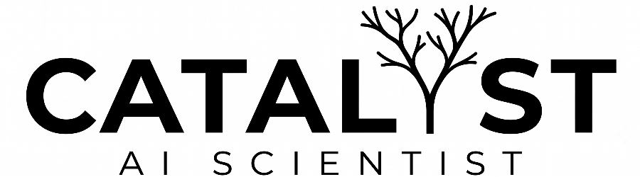

# Catalyst AI Scientist

A tool for semi-autonomous scientific research and discovery.

## What Catalyst Can Do

Catalyst provides three main workflows:
1. Autonomously develop a theory to explain a given phenomenon
2. Take a user-provided theory draft, fill in any gaps, and auto-correct mistakes and oversights
3. A menu of pre-defined operations to choose from: Review a theory for correctness, propose corrections and refinements, perform experimental validations, etc.

### Suitable Problems

Catalyst helps develop explanations for observable phenomena.

Suitable problems for the autonomous theory development workflow are of the shape:
* "When we do Y, we observe X. What is the mechanism that causes X?"
* "We sometimes see X while doing Y. Under what conditions does X happen, and why?"
* "Explain what happens when we do X."

In short, it aims to answer "Why" questions that lead to testable predictions.

The current implementation of Catalyst is designed to work for problems that can be understood through computational experiments and mathematical derivation. Our testing so far has been limited to problems in the field of machine learning / deep learning theory.

You will have a higher chance of success *if*:
* The phenomenon is described precisely and with little room for interpretation
* You're able to provide simplifying assumptions or limit the scope of the investigation upfront. E.g. "Only consider linear networks with the following loss function: ..."
* The phenomenon can be reproduced and probed at through programmatic experimentation, i.e. reproduced by a piece of Python code that you can run on your computer.
* You can describe the *shape* of the explanation that you are looking for. E.g. "I'm looking for an analytical explanation that makes exact predictions about property Y.", or "I'm looking for an empirically validated approximation that holds in the value range A-B.

### What Catalyst is Not a Good Fit For

Catalyst is *not* a good fit for:
* Optimization problems, e.g. "find the optimal hyperparameters for training this ANN", "discover a more optimal matrix multiplication algorithm", or "find a function that maximizes metric X"
* Problems with subjective or under-specified success criteria, e.g. "develop a theoretical framework for overfitting in deep learning"
* Engineering problems, e.g. "build an operating system for microcontrollers", "design an efficient HTML rendering engine"
* Problems that are significantly out of reach for the underlying base model, e.g. "Prove or disprove P=NP", "Unify quantum physics and general relativity into a practically testable theory of everything"
* Problems that require experiments that can't be run on a computer (life sciences, psychology, experimental physics, etc.)
* Problems that require significant computational resources to solve. Catalyst limits the runtime of any single experiment to no more than 30 minutes. Furthermore, it presently does not particularly optimize for compute and/or experiment efficiency.

### Why Choose Catalyst Over a Bare LLM Chat or Coding Agent?

Catalyst does not replace LLM Chat interfaces or off-the-shelf coding agents. Those remain a better fit for interactive, conversational exploration of a topic, and for any problems that don't fit the criteria mentioned above.

While Catalyst is built on top of those same LLMs, it adds unique techniques that allow it to produce results beyond the capabilities of the raw model and harness:

* Catalyst implements adversarial review-refinement loops: One set of agents continuously improves the generated theory, while separate, independent agents are tasked with falsifying its statements and identifying its limits.
* Catalyst deploys an evolution-inspired system to build a population of competing theories. The theories are repeatedly ranked against each other and checked against empirical data. The most promising theories are selected for further refinement.

## Getting Started

1. Before using Catalyst, carefully review the "Supported Models & Estimated Costs" section below.
2. `git clone https://github.com/imbue-ai/catalyst.git && cd catalyst`
3. `git checkout stable` to use the stable branch
4. Install [prerequisites](src/README.md#prerequisites)
5. `cd src && ./run.sh`
6. Follow the [Quickstart Guide](src/docs/quickstart.md) for next steps.

## Supported Models & Estimated Costs

Catalyst utilizes an existing agentic harness installed on your system. It currently supports the following harnesses:
* Claude Code (either via `claude -p` or via [mngr](https://github.com/imbue-ai/mngr))
* Gemini CLI (via `gemini -p`)
* Antigravity CLI (via `agy -p`)
* Codex CLI (via `codex exec`)

Token usage will be billed directly by the provider (currently Anthropic or Google), based on the harness' existing authentication.

Before using Catalyst, please familiarize yourself with the expected costs listed below. **The evolution-based workflows in particular are frequently composed of >100 subagents, and can incur significant token usage.**

The costs shown below are rough estimates (order of magnitude), and will vary **significantly** depending on your research task. Even when using a subscription, extra charges may apply after you exhaust your plan's rate limits depending on your configuration (Anthropic Usage Credits, Gemini AI Credits etc.). **Please monitor your provider's spend dashboard to avoid unwanted surprises.**

| Harness | Can use subscription plan? | Runs in sandbox | Model | Cost per "Develop Theory (Evolution)" | Cost per "Develop Theory (Linear)" | Cost per manual step |
| -- | -- | -- | -- | -- | -- | -- |
| **Claude Code** | No, only API-pricing after 06/15/2026 | Yes | Opus 4.8 | ~$1,000 USD | ~$200 USD | ~$20 USD |
| | | | Sonnet 4.6 | ~$500 USD | ~$100 USD | ~$10 USD |
| | | | Haiku 4.5 | ~$150 USD | ~$30 USD | ~$3 USD |
| **Claude Code (via mngr)**  | Yes, Max 20x recommended | Yes | Opus 4.8 | included in plan (1-2 per week with Max 20x), see above when using API auth | included in plan (~5 per week with Max 20x), see above when using API auth | included in plan, see above when using API auth |
| | | | Sonnet 4.6 | included in plan, see above when using API auth | included in plan, see above when using API auth | included in plan, see above when using API auth |
| | | | Haiku 4.5 | included in plan, see above when using API auth | included in plan, see above when using API auth | included in plan, see above when using API auth |
| **Gemini CLI** | No, only API-pricing after 06/18/2026 | Yes | 3.5 Flash | ~$200 USD | ~$40 USD | ~$4 USD |
| | | | 3.1 Pro | ~$300 USD | ~$60 USD | ~$6 USD |
| | | | 3 Flash | ~$100 USD | ~$20 USD | ~$2 USD |
| **Antigravity CLI** | Yes, AI Ultra recommended | [No](https://github.com/google-antigravity/antigravity-cli/issues/286) | 3.5 Flash | included in plan, same as Gemini CLI when using API auth | included in plan, same as Gemini CLI when using API auth | included in plan, same as Gemini CLI when using API auth |
| | | | 3.1 Pro | included in plan, same as Gemini CLI when using API auth | included in plan, same as Gemini CLI when using API auth | included in plan, same as Gemini CLI when using API auth |
| **Codex CLI** | Yes, Pro 20x recommended | Yes | GPT 5.5 | included in plan, ~$500 USD with API auth | included in plan, ~$100 USD with API auth | included in plan, ~$10 USD with API auth |

## Further Documentation

Additional information can be found in the following guides:

- [Setup](src/README.md): Prerequisites, setup & troubleshooting instructions.
- [Quickstart Guide](src/docs/quickstart.md): An overview of the system structure and how to run you research.
- [Workflows and Add-ons](src/docs/workflow.md): A reference for all primary workflows and individual add-on steps.
- [CLI Agent Usage](src/docs/cli.md): Instructions for using AI Scientist skills directly within a CLI agent.

## Contributors

Catalyst is built by your friends at [Imbue](https://imbue.com):

* [Daniel Mewes](https://github.com/danielmewes/)
* [Catherine Kim](https://github.com/catherinek07/)
* [Evan Ryan Gunter](https://github.com/evgunter)
