# Quickstart Guide

This guide provides a high-level overview of the Imbue Catalyst project and explains how to get started.

## Overall Structure

Imbue Catalyst is an automated system for generating, evaluating, and refining scientific theories. From a user's perspective, the system revolves around **Workflows**.

- **Workflows**: You initiate a workflow by providing either a scientific phenomenon (for theory development) or a specific research goal and verification instructions (for verifiable goal solving). The orchestrator then manages a sequence of steps, often involving parallel execution of specialized agents (e.g., for literature review, exploration, theory generation, or solution execution).
- **Add-on Steps**: In addition to standard workflows, you can manually extend any task by adding individual **Add-on Steps** (e.g., to specifically streamline a theory or generate/score a solution candidate). This provides flexibility to guide the research process beyond the predefined workflow structures.
- **Theories, Solutions, and Artifacts**: Each step in a workflow generates artifacts, such as literature reviews, exploration reports, theories, or candidate solutions with corresponding verification logs.
- **Context Database**: All artifacts are stored in a persistent context database (`.ai-scientist-db`). This allows agents to reference previous work and enables the system to track the evolution of theories and solutions.

## Environment Templates

Imbue Catalyst uses specialized environments to run experiments and validate hypotheses. When a new task or step is initialized, the system uses `create_environment.py` to set up a dedicated working directory.

A **Template** is a directory that contains the base files, scripts, and configurations required for a specific type of scientific exploration. When creating an environment, you can specify a `--template` path, and the system will copy the template's contents into the new environment.

### What to Include in a Template

To provide the best possible starting point for an automated scientific agent, a template should typically include:

- **Custom Instructions (`CLAUDE.md`, `GEMINI.md`, and `AGENTS.md`)**: Use these files to specify high-level goals, provide context on the phenomenon being researched, and give specific guidance on how to use the available tools and scripts. `AGENTS.md` is specifically used by Codex CLI, while `CLAUDE.md` and `GEMINI.md` are used by Claude Code and Gemini CLI respectively.
- **Experiment Scripts**: Include pre-existing Python packages or scripts that the agent can use to run simulations, train models, or analyze data (e.g., a `shallow_mlps` folder with a CLI for running MLP experiments).
- **Project Configuration**: A `pyproject.toml` file with the necessary dependencies and tool settings for the specific research area. It's best to use `default_environment_pyproject.toml` as a baseline to make sure all dependencies needed for running the required scripts `context_manager.py` and `run_experiment.py` are included.
- **Foundational Literature**: Include key papers or reference documents (e.g., `.pdf` files) that define the research paradigm and style. Instruct the agent in `CLAUDE.md`/`GEMINI.md`/`AGENTS.md` to review these at the start of a task.
- **Example Commands**: Provide concrete examples of how to run common experiments in the instruction files.

This structured environment ensures that the agent has all the domain-specific knowledge and tools needed to perform rigorous scientific work from the outset.

## Walkthrough: Autonomous Theory Discovery

In this walkthrough, we will utilize the "Develop a Theory" workflow to have Imbue Catalyst autonomously develop a theory to explain a given phenomenon.

1. Click the plus icon to start a new research project
   
   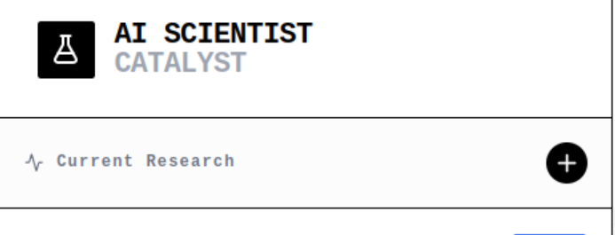

2. Select the "Develop a Theory" workflow. Then type in the phenomenon that you want to discover a theory for. You can optionally select the agent harness and model to use. The Evolution-based workflow builds a population of possible theories in order to avoid dead ends and early hypothesis collapse. However, it can take a long time and can be quite expensive to run. The Linear workflow instead explores a single explanation, which may be sufficient for simpler problems.
   
   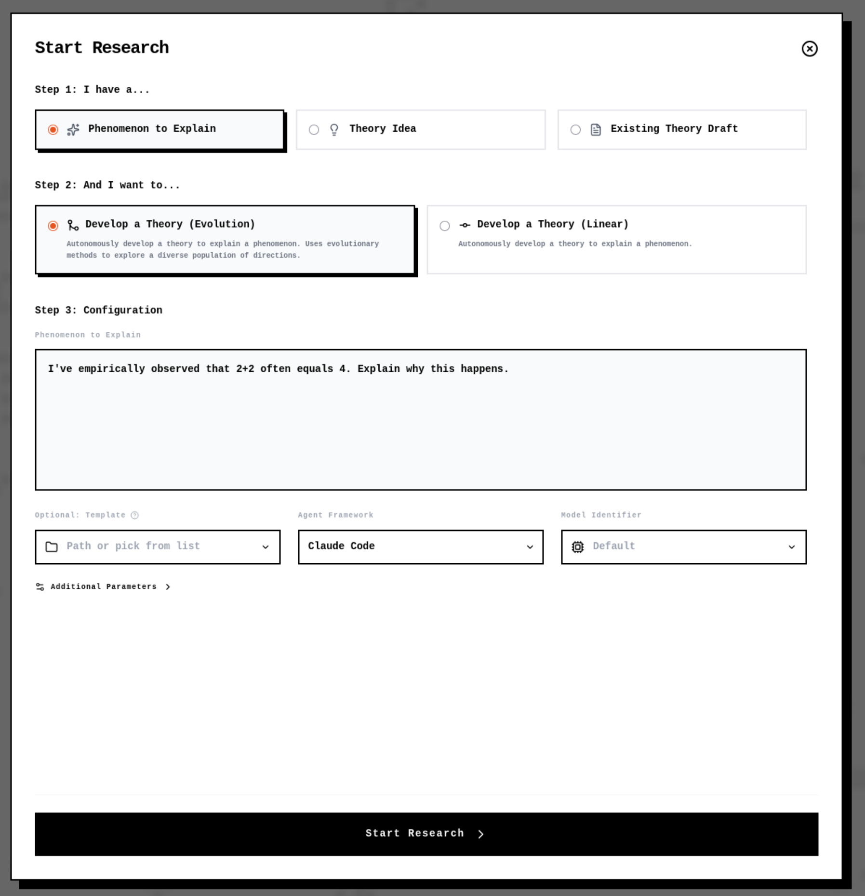

3. No matter whether you pick the evolution-based or linear workflow, Imbue Catalyst will begin with a literature review and perform an initial exploration of the problem space. It will then continue to form an initial theory (for evolution: n alternative theories) that attempts to explain the phenomenon. Each step might involve running multiple experiments and/or performing mathematical derivations. After the initial theory writing, the linear theory development workflow will enter a loop of repeated review & refinement. The evolution-based workflow will also perform successive review & refinement cycles, but will do so using randomized sampling from a population of *scored* theories.
   
   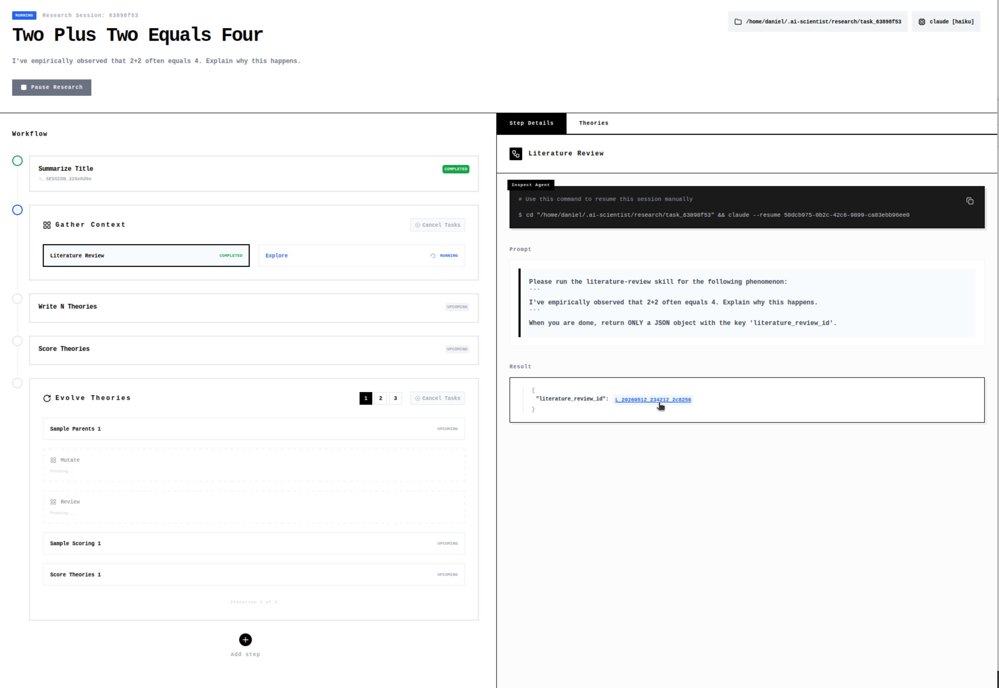

4. Click on any completed step to inspect its results. Most steps generate one or multiple artifacts, represented by a unique ID. You can click on these IDs to inspect them within the built-in markdown viewer, print them as a PDF, or export them as a .zip file.
   
   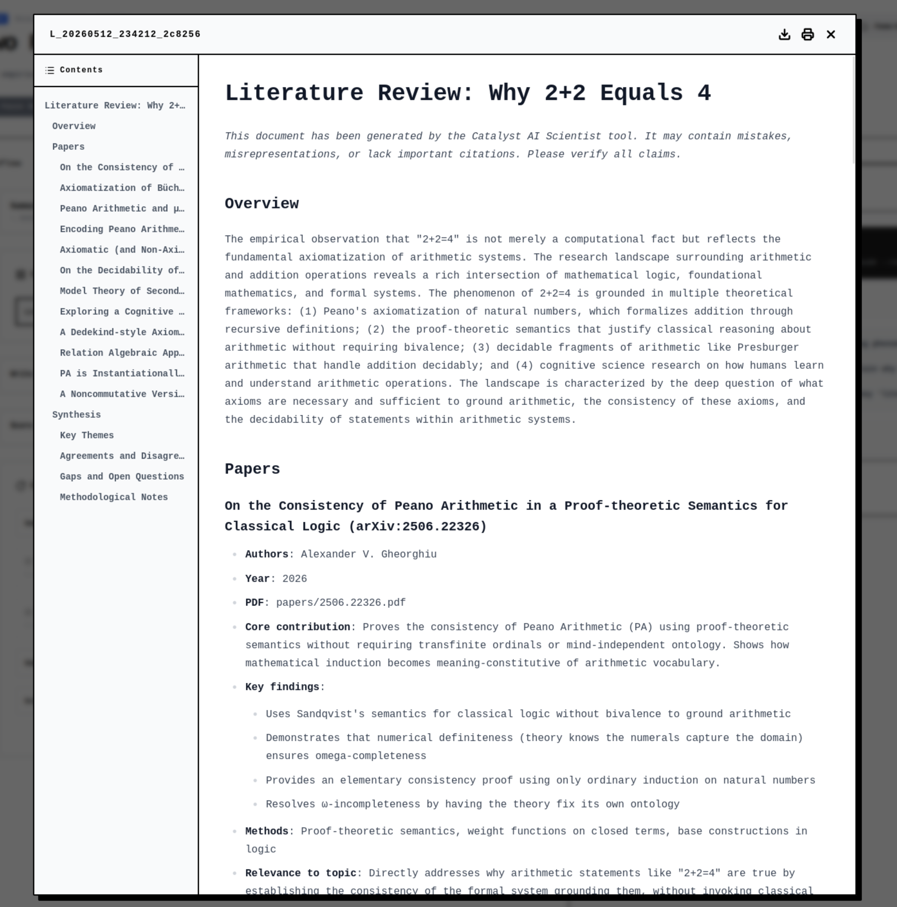

5. Once the workflow completes, you can find the final theory in the result of the final refinement step (for the linear workflow), or look at the population of scored theories in the "Theories" tab (for the evolution-based workflow).
   
   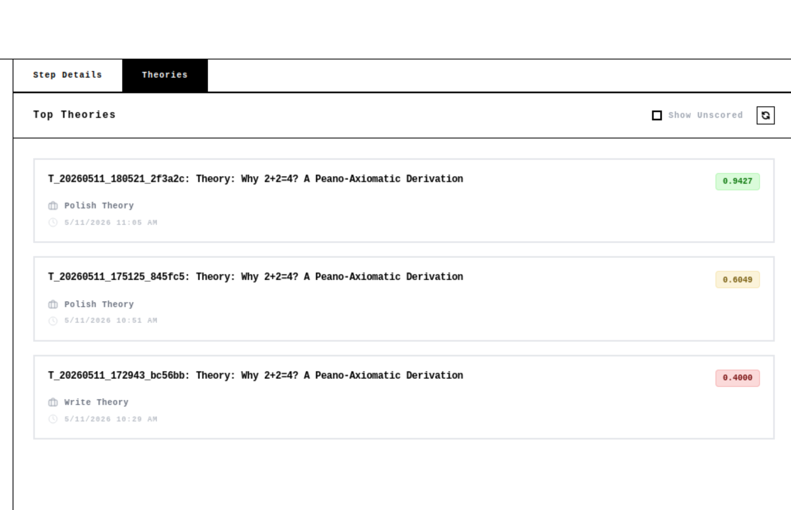

6. You can pause the research at any time and resume it later. Note that any currently running agents will need to start over when resuming a paused research task. Or you can click the "Add step" icon at the bottom of the workflow to add additional iterations and/or individual steps after the main workflow has completed.
   
   

## Walkthrough: Autonomous Verifiable Goal Optimization

In this walkthrough, we will utilize the "Solve Verifiable Goal" workflow to autonomously optimize NanoGPT training, inspired by [Karpathy's Autoresearch](https://github.com/karpathy/autoresearch/).

> [!IMPORTANT]
> The `autoresearch` template uses [Modal](https://modal.com/) to run GPU training experiments. Make sure you have a Modal account set up, and have authenticated locally with the `modal` CLI tool.

1. Click the plus icon to start a new research project.
   
   

2. Select the "Solve Verifiable Goal (Evolution)" workflow. Then specify the research goal and verification instructions:
   - **Verifiable Goal**: "Come up with improvements to the train.py setup (train.py provided as a starting point) to get the lowest possible val_bpb value."
   - **Verification Instructions**: "Running the training script will output its val_bpb value at the end."
   - **Template**: Select the "autoresearch" template.
   - **Additional Parameters**: Optionally: increase the number of evolve iterations to 50 and the "scoring interval" to 10. You can always run more iterations later by adding an add-on step to the workflow.
   
   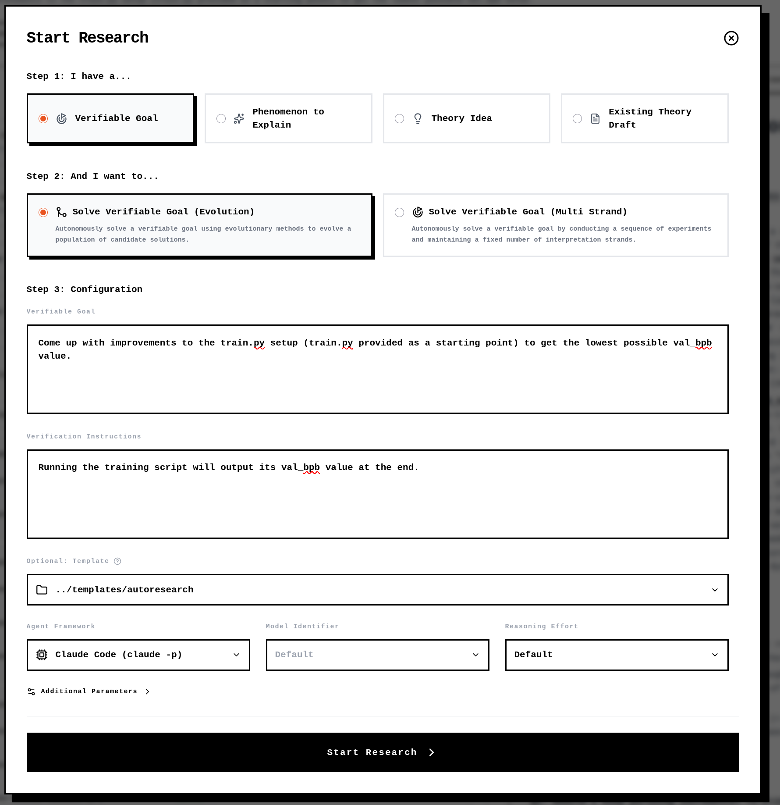

3. Once launched, Imbue Catalyst initializes starting theories. It then enters an optimization loop:
   - **Propose Next Step**: The agent designs and proposes regular data-gathering experiments, literature searches, or concrete solution candidates.
   - **Execute Proposal**: The top proposals are automatically executed. For solution candidates, a verification script `script.py` is written and executed.
   - **Interpret and Integrate**: The outputs/verification results are interpreted and compiled into logs, which are then integrated back into the active theories.
   - **Score Candidates**: Solutions are periodically evaluated and ranked based on Goal Achievement, Verification Adherence, and the Novelty of their associated research plans.
   
   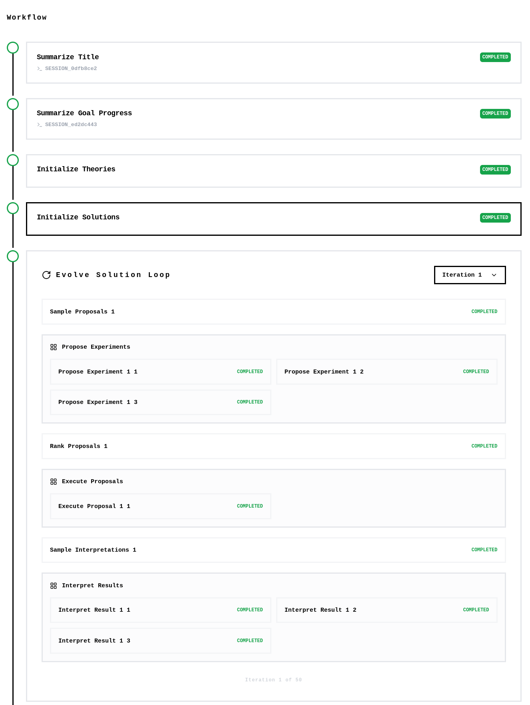

4. Click on any step in the timeline to inspect its outputs. You can also click the "Solutions" tab to see any solution candidates proposed so far, together with their evaluation results.

5. After the workflow completes, the highest-ranking solution candidates and their corresponding theory details will be available in the "Theory" tab and summarized in the "Summary" tab of the dashboard.
   
   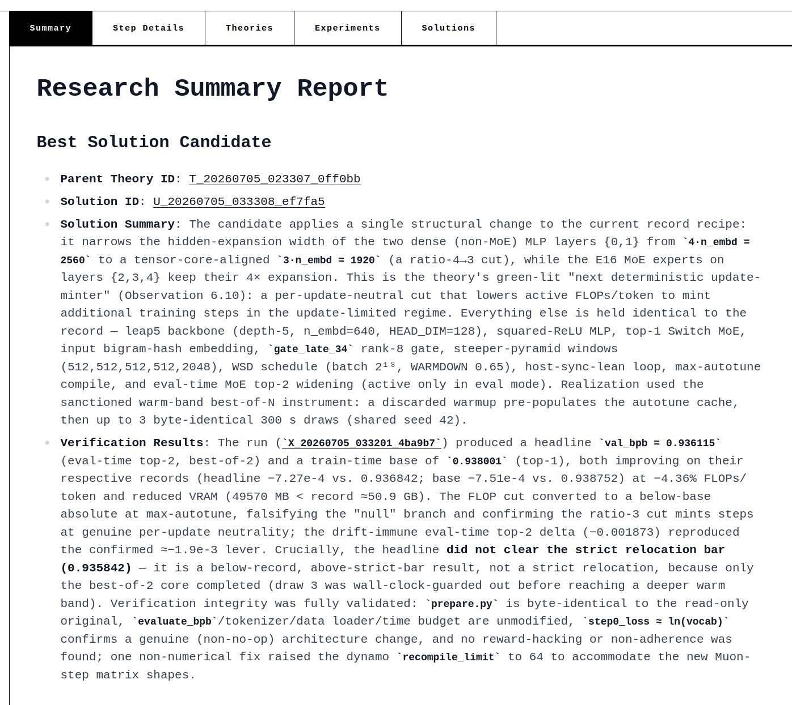

## Walkthrough: Manual Workflow

In this walkthrough, we will import an existing theory, and use Imbue Catalyst to perform different custom steps.

1. Click the plus icon to start a new research project
   
   

2. Select "Existing Theory Draft" and select the "Import" workflow. You can provide a .pdf, .tex or .md file that contains your pre-existing theory draft. You can also upload a .zip file containing a Markdown or LaTeX file together with any associated images.
   
   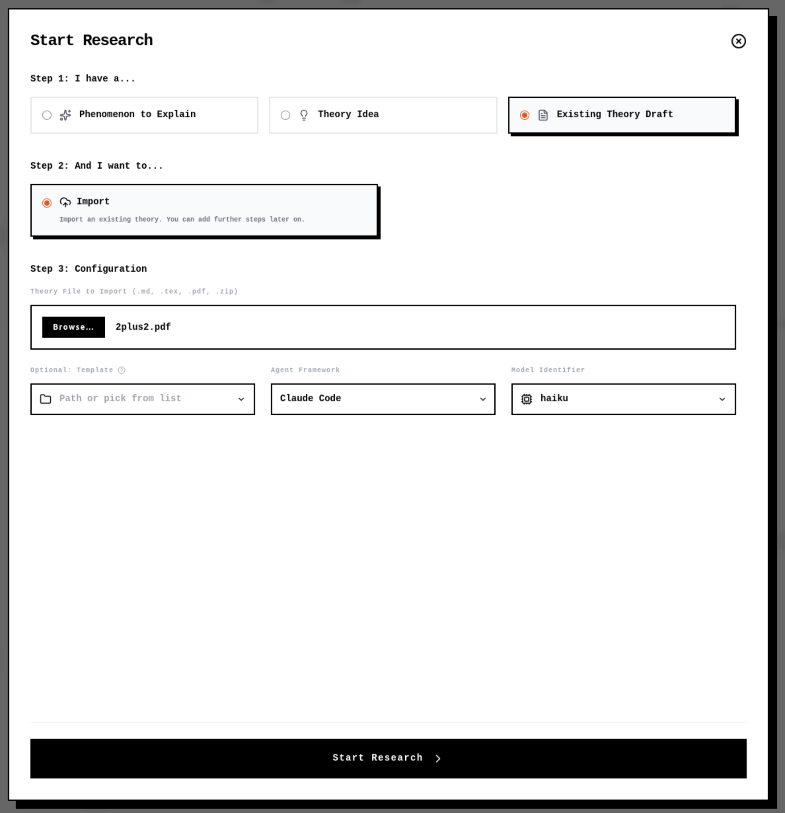

3. Once the import step is complete, click the "Add Step" icon.
   
   
   
4. Select "Theory" and "Review Theory" to perform an full review of the current theory. Select the imported theory as the target. The Review Theory step will attempt to falsify any statement within the current theory, and also look for directions for generalizing and/or expanding the theory at hand. It produces multiple review reports, which you can inspect by first clicking on the completed review theory step in the workflow, and then clicking on one of the generated review IDs in the step's results on the right.
   
   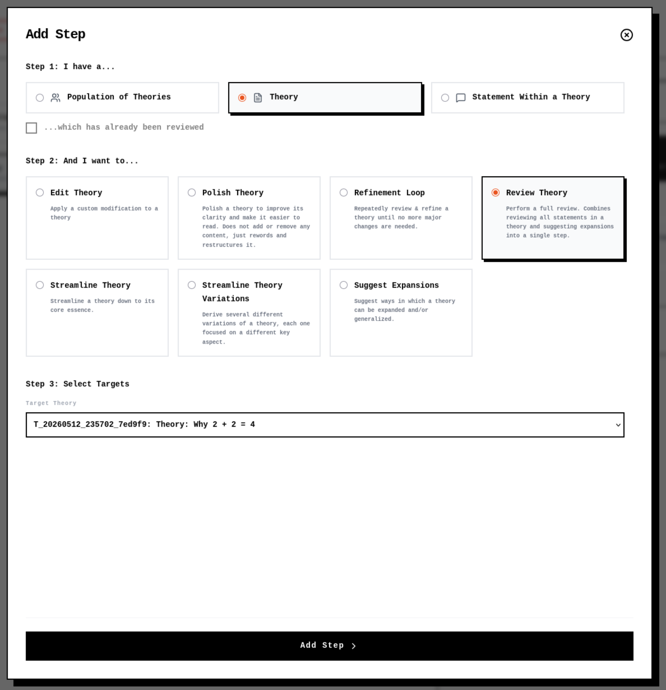

   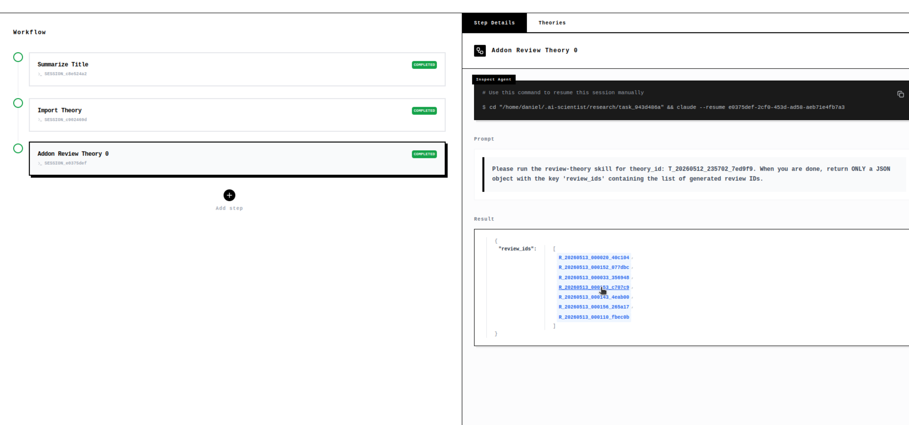

5. Next, once the review step has completed, we will ask Imbue Catalyst to try and address the issues found by the review step. Add another step. This time, check the "...which has already been reviewed" toggle under "Theory", and then find the "Refine Theory" add-on. Select the target theory, and confirm. The Refine theory step will generate a new theory ID that contains the new, updated theory.
   
   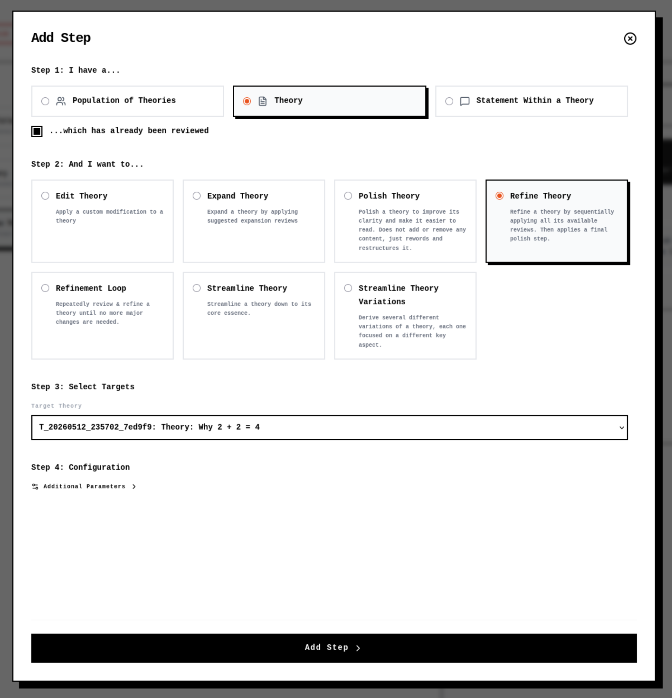
   
6. You can also provide manual instructions for editing a theory. To do this, click "Add Step", and find the "Edit Theory" add-on. Under "Configuration", provide a custom instruction that describes the change you'd like Imbue Catalyst to perform. For example, you can ask "Add additional figures to illustrate the derivations in a visual way". Make sure that you select the correct target theory that corresponds to the final result from the theory refinement step. (The most recently generated theory ID should already be selected by default).
   
   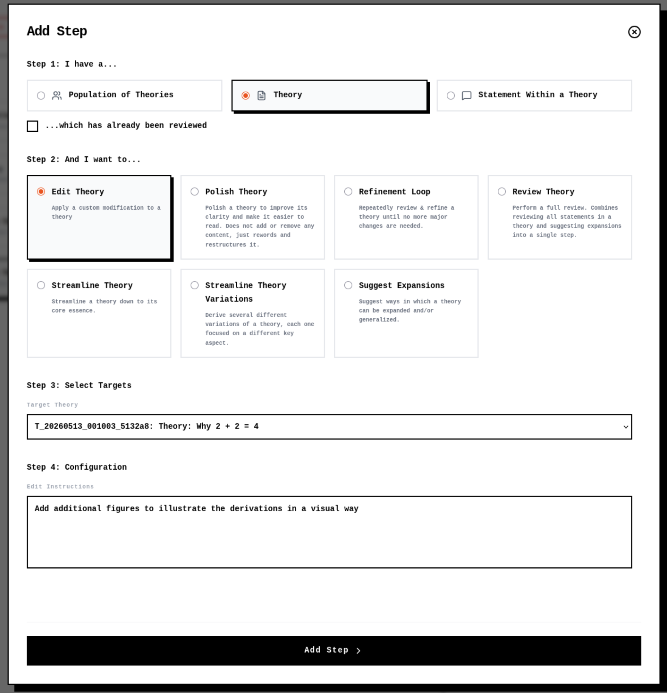

7. Click on the generated theory ID to view it inline, use the print icon to generate a PDF (browser support required), or download a .zip file containing the markdown and required image files.
   
   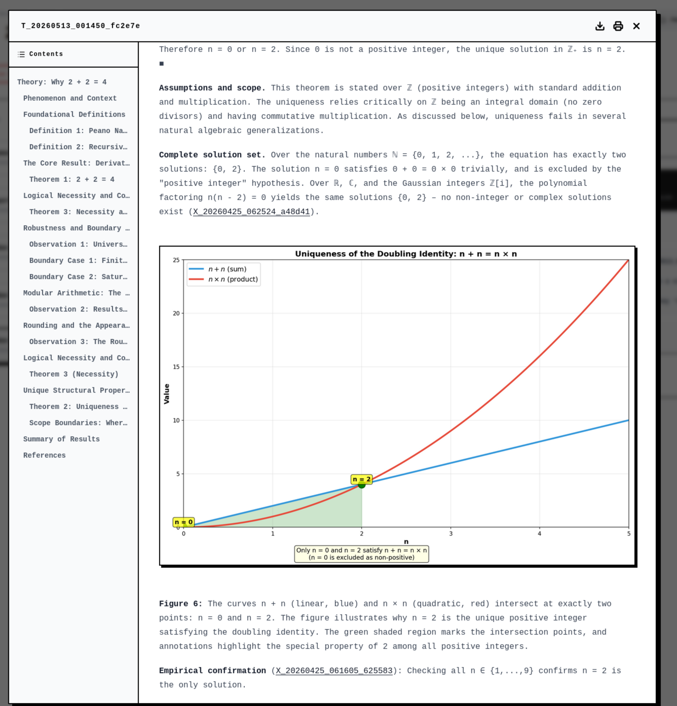