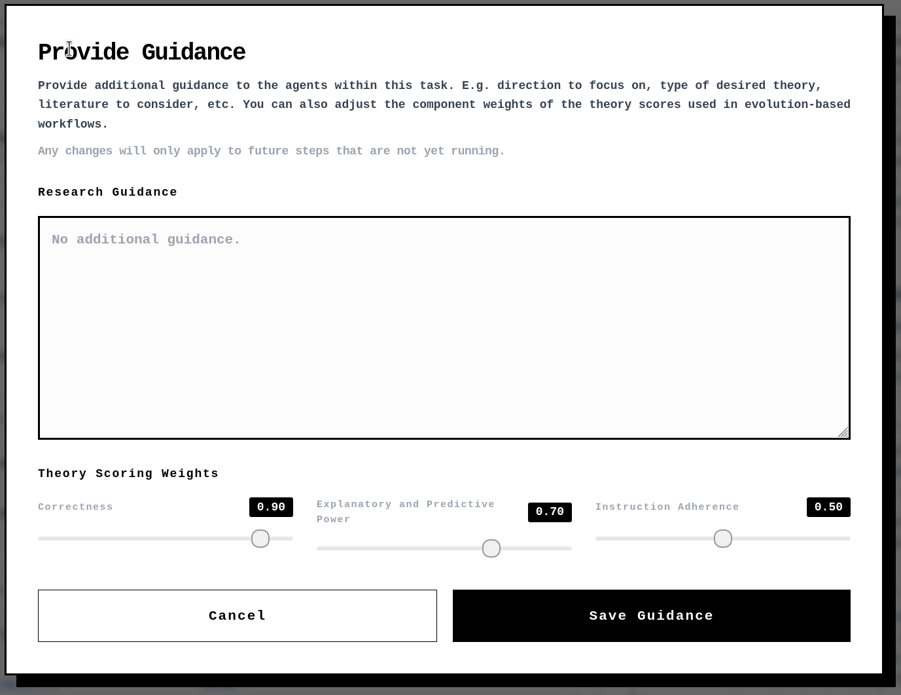
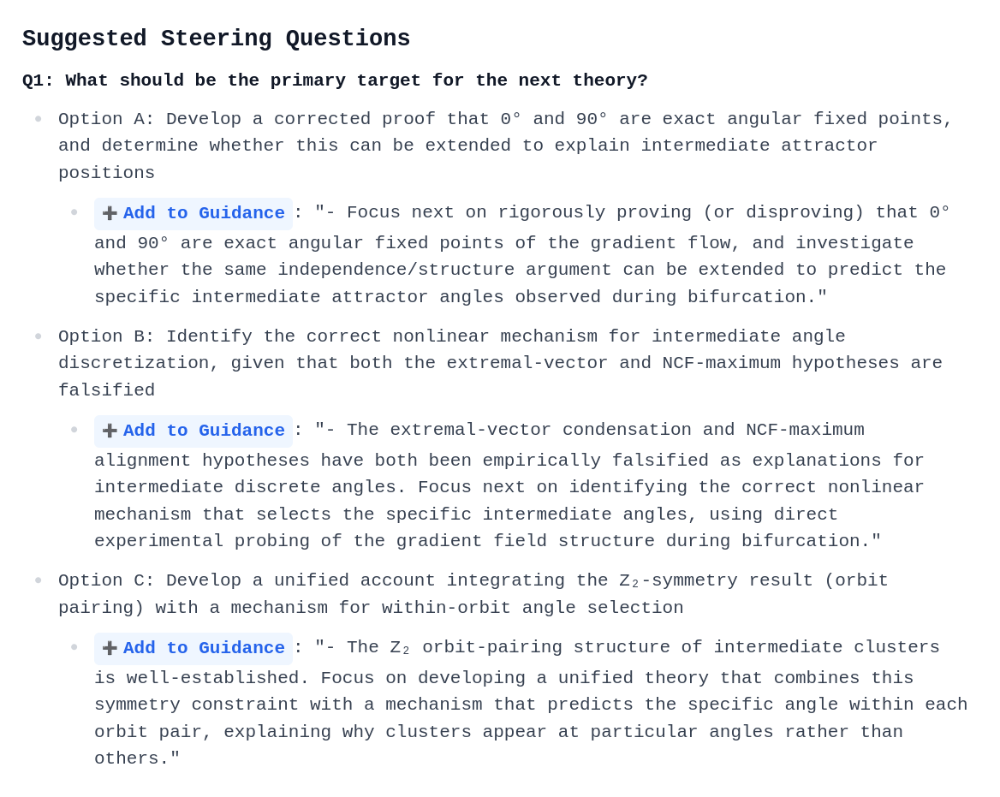

# Mid-Research Steering

You can provide additional steering to influence the research direction of your Imbue Catalyst agents at any time.

## How Steering Works

While the provided research guidance is read by all steps in the workflow, it explicitly affects:
1. **The "Adherence Score" of a Theory**: This score is generated by the `score-theories` step to evaluate how closely theories align with the guidance.
2. **Adherence Steps**: The `review-adherence` and `improve-adherence` steps, which run as part of the standard `review-theory` and `refine-theory` steps, actively work to make theories better align with your input.

Any changes you make to the guidance will be picked up automatically by an ongoing evolve theory or refine theory loop.

## Providing Guidance

### Manual Steering
You can provide guidance at any point by clicking the **Provide Guidance** button in any active or paused research task. This opens a modal where you can edit the research guidance text and adjust theory scoring weights (Correctness, Explanatory and Predictive Power, and Instruction Adherence).

### Suggested Guidance Additions
The generated **Research Summary Report** contains suggested guidance additions based on current research progress.

You can apply these suggestions with a single click:
* Look for the **Suggested Steering Questions** section in the report.
* Click the highlighted **Add to Guidance** action link.
* This automatically opens the **Provide Guidance** modal with the suggestion appended to your existing guidance text.
* Click **Save Guidance** to apply the update.
